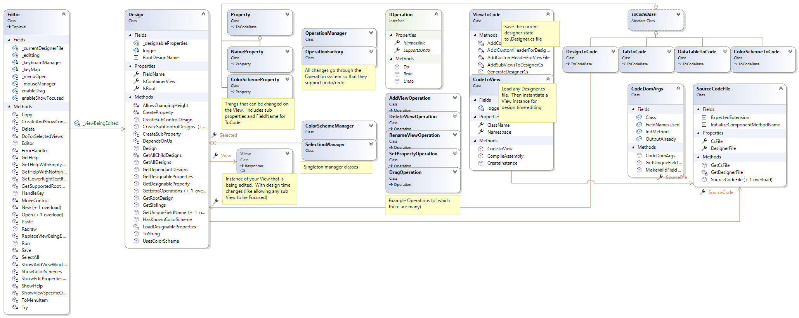

# Terminal Gui Designer

 [](https://www.nuget.org/packages/TerminalGuiDesigner/)

Cross platform designer for [Terminal.Gui](https://github.com/migueldeicaza/gui.cs) applications.  

Built with CodeDom and Roslyn, TerminalGuiDesigner lets you create complicated Views with drag and drop just like the WinForms designer you know and love (or hate).

Install the tool from NuGet or follow the [Hello World Tutorial](./README.md#usage):
```
dotnet tool install --global TerminalGuiDesigner
```

This project is in alpha.  See the [feature list](./README.md#features) for progress.


### Building
----------------
Build using the dotnet 6.0 sdk
```
cd src
dotnet run
```

### Usage
------------------
Install the dotnet sdk and create a new console application with references to Terminal.Gui.  Install the TerminalGuiDesigner and create a new dialog:
```
dotnet new console -n hello
cd hello
dotnet add package Terminal.Gui
dotnet tool install --global TerminalGuiDesigner
TerminalGuiDesigner MyDialog.cs
```

Enter a namespace then add a Button to the view.  Save with Ctrl+S.

Enter the following into Program.cs

```csharp
using Terminal.Gui;

Application.Init();

Application.Run(new YourNamespace.MyDialog());

Application.Shutdown();
```

Run your program with 
`dotnet run`

You can add new code to `MyDialog.cs` but avoid making any changes to `MyDialog.Designer.cs` as this will be rewritten when saving.

You can remove the tool using the following:

```
dotnet tool uninstall --global TerminalGuiDesigner
```

### Keybindings
----------------
You can change keybindings by copying [Keys.yaml](https://raw.githubusercontent.com/tznind/TerminalGuiDesigner/main/src/Keys.yaml) into your current directory.

### Features
-------------------------------

The following feature list shows the current capabilities and the roadmap

- [ ] Design classes 
    - [x] Window
    - [x] Dialog
    - [ ] View
    - [ ] Top level (with statusbar and or menu)
- [x] Configure root properties (e.g. Window.Width, Title etc)
- [ ] Configure subview properties
    - [x] (Name)
    - [x] X/Y
    - [x] Width/Height
    - [x] Text
    - [ ] Color Schemes
- [x] Mouse Input
  - [x] Drag to move
  - [x] Drag to resize
- [x] Undo/Redo
- [x] Direct editing of Text just by typing
- [ ] Easy Menu Bar Designing
- [ ] Easy Status Bar Designing
- [ ] Create Events e.g. MyButton_OnClick
- [ ] Mutli select (select many views and hit delete or drag move)
- [ ] Copy/Paste selected view(s)
- [ ] Add views to subviews
- [ ] Read and present xmldoc comments when editing properties
- [x] Comprehensive Tests
- [x] CI
- [ ] Create and edit all views
  - [x] Button
  - [x] Checkbox
  - [ ] ComboBox
  - [x] DateField
  - [x] FrameView
  - [x] GraphView
  - [x] HexView
  - [x] Label
  - [x] LineView
  - [x] ListView
  - [ ] MenuBar
  - [ ] PanelView
  - [x] ProgressBar
  - [x] RadioGroup
  - [ ] StatusBar
  - [x] TableView
  - [x] TabView
  - [x] TextField
  - [x] TextValidateField
  - [x] TextView
  - [x] TimeField
  - [ ] TreeView
  - [ ] View

### Class Diagram
-------------------------------

